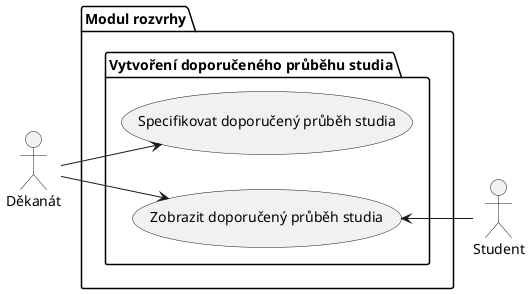
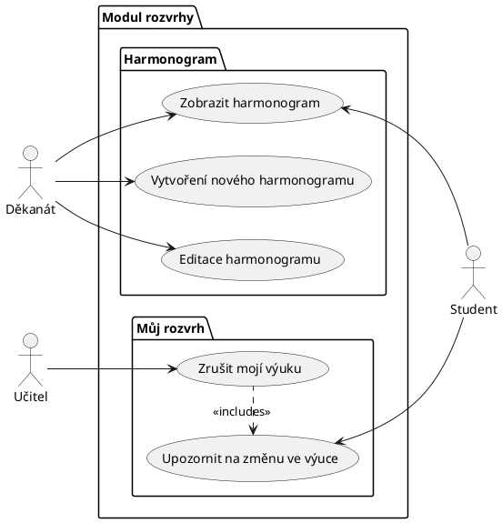
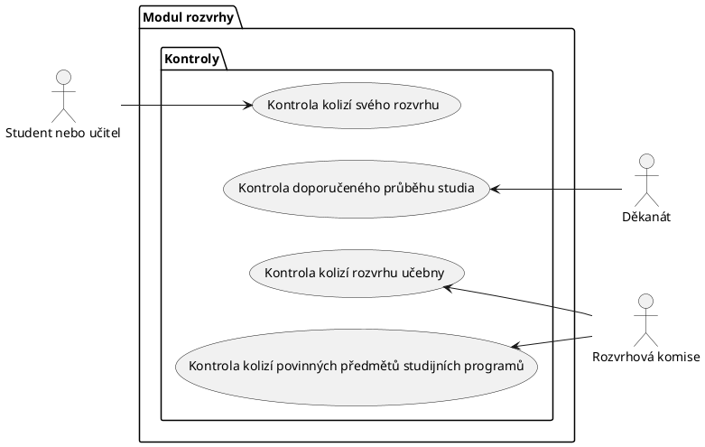
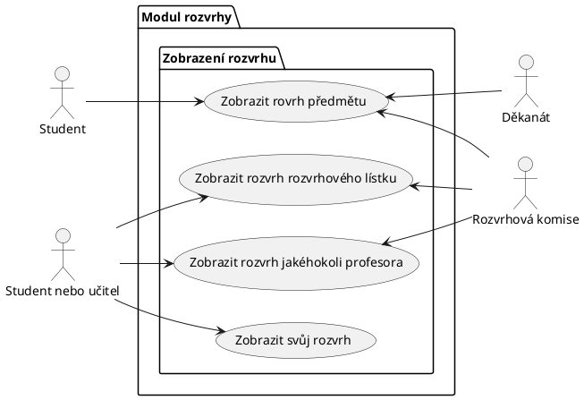
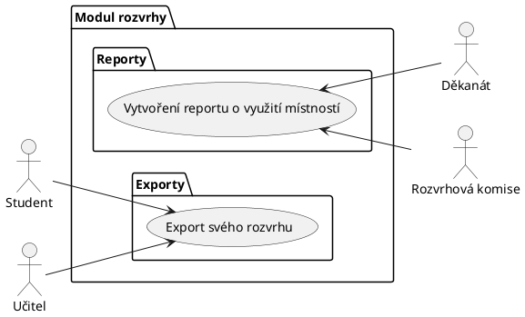
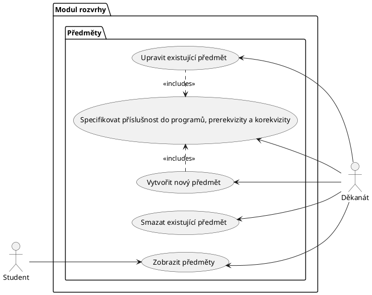
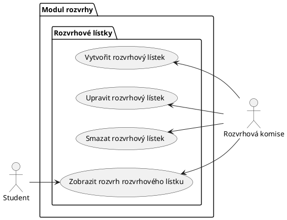
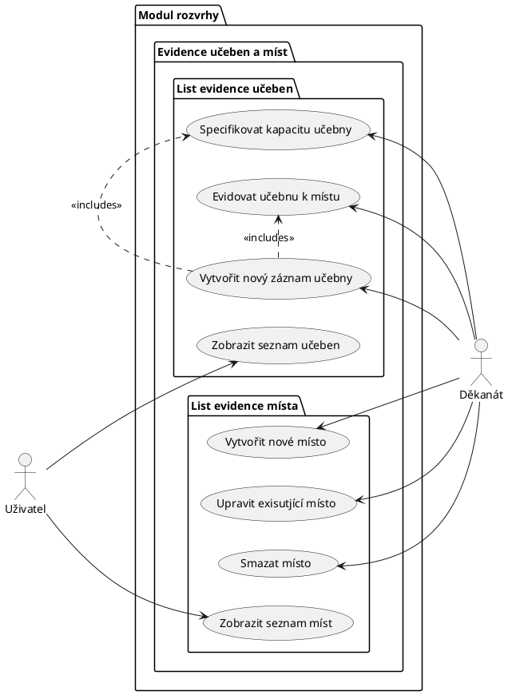
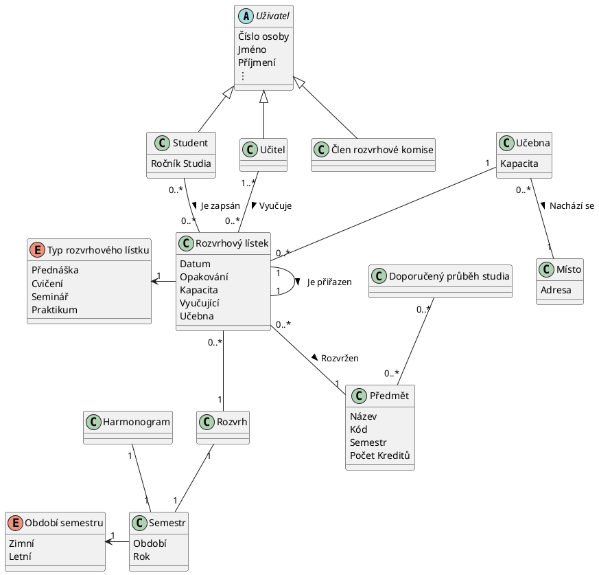

# Studentský informační systém - Modul rozvrhy

Modul rozvrhy slouží k vytváření a prohlížení rozvrhů.
V rámci modulu jsou vedeny předměty a jejich příslušnost do studijních programů a jednotlivých semestrů studia,
ve kterých jsou v rámci programu doporučeny.
Dále jsou v rámci modulu vedeny učebny pro výuku a jejich kapacita.
Pro každý předmět jsou evidovány rozvrhové lístky přednášek a cvičení, včetně jejich kapacit a vyučujících.
Modul umožňuje rozvrhové komisi v jednotlivých semestrech vytváření centrálních rozvrhů přiřazováním rozvrhových lístků k učebnám na konkrétní den v týdnu a hodinu.
Předměty ve stejném studijním programu a semestru musí být rozvrhovány tak, aby měli studenti v daném studijním programu a semestru možnost tyto předměty navštěvovat.
Dále nesmí docházet k časovým kolizím jednoho učitele.
Modul umožňuje vytvářet statistické reporty o vytíženosti místností v jednotlivých semestrech.

## Funkční požadavky

### Uživatelské požadavky

1. Děkanát potřebuje mít možnost vytvořit předmět, aby rozvrhová komise mohla vytvořit rozvrhové lístky danému předmětu.

2. Děkanát potřebuje mít možnost upravit předmět, aby pokud dojde ke změnám v daném předmětu (např. změna názvu), rozvrhová komise pracovala s aktuálními daty.

3. Děkanát potřebuje mít možnost smazat předmět, aby pokud se daný předmět zruší, nebyl již v systému dále registrovaný a rozvrhová komise k tomuto předmětu nevytvářela rozvrhové lístky.

4. Děkanát by měl být schopen specifikovat příslušnost předmětu do studijního programu a prerekvizity, korekvizity... předmětu, aby studenti při zápisu věděli, zdali mají již všechny potřebné znalosti pro tento předmět.

5. Jako děkanát potřebujeme být schopni specifikovat doporučený průběh studia, aby studenti:
   - věděli, ve kterých semestrech si mají zapsat jaké předměty
   - měli splněné prerekvizity a byli schopni lépe splnit všechny požadavky.
  Dále je to potřebné, aby rozvrhová komise věděla, které kombinace předmětů bude mít většina studentů zapsané ve stejném semestru a mohla je dát na různá místa v rozvrhu.

6. Děkanát by měl být schopen zaevidovat místo (areál ve kterém výuka bude probíhat), aby:
   - Se mohla k místu přiřadit učebna a provést kontrala návaznosti rovržení výuky
   - Studenti a učitelé věděli, kam se mají dostavit na výuku.
   - Rozvrhová komise mohla dát předměty pro stejný studijní program a semestr na jedno místo.

7. Děkanát by měl být schopen zobrazit seznam všech učeben, aby věděl jaké učebny a k jakým místům eviduje.

8. Děkanát by měl být schopen zaevidovat do systému učebnu, tj. přiradit ji k místu a specifikovat její kapacitu, aby ji rozvrhová komise mohla přidělit jednotlivým rozvrhovým lístkům a studenti a učitelé věděli kde budou mít výuku.

9. Jako děkanát chceme být schopni specifikovat a zobrazit harmonogram, aby:
     - Všichni uživatele věděli: kdy začíná a končí výuka, zkoušková období, kdy jsou prázdniny
     - Systém věděl, kdy má zobrazovat jaký rozvrh.

10.  Jako děkanát bychom měli mít možnost si nechat automaticky vygenerovat statický report o vytížení místností v jednotlivých semestrech, abychom mohli dělat orgranizační rozhodnutí na základě těchto dat (úprava vytápění místností, zajištění nových prostor atd.).

11.  Jako děkanát si musíme být schopni zobrazit rozvrh předmětu, abychom mohli kontrolovat, zda probíhá výuka.

12.  Jako děkanát potřebujeme kontrolu, že doporučený průběh studia odpovídá prerekvizitám, abychom věděli, jestli jsme doporučený rozvrh navrhli tak, aby studenti byli schopni ho použít.

13.  Rozvrhová komise by měla být schopna vytvořit rozvhový lístek, aby se studenti mohli na daný předmět zapsat.

14.  Rozvrhová komise by měla být schopna smazat rozvhový lístek, aby se studenti na příslušný předmět nemohli zapisovat, pokud dojde ke zrušení předmětu, ke kterému je tento lístek určen.

15. Rozvrhová komise by měla být schopna upravit rozvhový lístek, aby pokud vznikne při vytváření lístku chyba v obsahu, mohl být lístek upraven a studenti měli aktuální platná data.

16. Jako rozvrhová komise potřebujeme zobrazit rozvrh jakéhokoli učitele, abychom věděli, jestli jsme k rozvrhovým lístkům přiřadili správné učitele.

17. Jako rozvrhová komise potřebuji mít možstost provést kontrolu kolizí předmětů ve stejném studijním programu a semestr, aby měli studenti v daném studijním programu a semestru možnost tyto předměty navštěvovat.

18. Jako rozvrhová komise chci kontrolu, že v jedné učebně nejsou naplánované dva termíny ve stejnou dobu, abych zabránil časovým konfliktům.

19. Jako rozvrhová komise si musíme být schopni zobrazit rozvrh předmětu, abychom mohli kontrolovat, jestli jsme rozvrhové lístky naplánovali na dostatečné množství různých termínů.

20. Jako rozvrhová komise si musíme být schopni zobrazit rozvrh rozvrhového lístku, abychom mohli zkontrolovat, že daný rozvrhový lístek dává smysl (jednotlivé části se nepřekryjí atd.).

21. Jako rozvrhová komise bychom měli mít možnost si nechat automaticky vygenerovat statický report o vytížení místností v jednotlivých semestrech, abychom mohli lépe rozvrhovat výuku na základě těchto dat. Michael

22. Jako student nebo učitel potřebuju exportovat svůj rozvrh, abych si ho mohl dát do kalendáře.

23. Jako student nebo učitel potřebuju zobrazit svůj rozvrh, abych věděl, kdy a kde mám být.

24. Jako student nebo učitel potřebuju zobrazit rozvrh jiného učitele, abych věděl, kdy se s ním můžu sejít.

25. Jako student si musím být schopen zobrazit rozvrh předmětu, abych si mohl vybrat pro mě vhodnou paralelku přednášky či konkrétní vhodné cvičení.

26. Jako student si musím být schopen zobrazit rozvrh rozvrhového lístku, abych se mohl rozhodnout zda mi vyhovuje.

27. Jako student bych měl mít možnost nechat si zasílat upozornění na změnu ve výuce, abych věděl, kdy a kam mám přijít.

28. Jako student potřebuji mít možnost provést kontrolu kolizí příhlášených předmětů, abych je mohl všechny navštěvovat.

29. Jako učitel potřebuji mít možnost zrušit svou výuku v daném termínu, abych dal vědět účastníkům výuky, že se nemusí dostavit.

30. Učitel má možnost požádat systém o provedení kontroly, aby mohol navštěvovat všechny termíny jeho výuky.

### Systémové požadavky

#### Actors

##### Děkanát
Je výkonný orgán řízení fakulty po stránce hospodářské a administrativní.

##### Rozvrhová komise
Poradní orgán pro děkanát, který se zabývá vytvářením předmětů.

##### Uživatel
Osoba, která má přístup do univerzitního systému.

##### Student
Osoba, která je zapsána ke studiu.

##### Učitel
Osoba, která vyučuje předmět.

#### **Use case scenario**: Specifikace (vytvoření) doporučeného průběhu studia

**Cíl:** Navrhnout doporučený průběh studia pro studenty s ohledem na prerekvizity a požadavky studijního programu.

**Předpoklady**
- `Uživatel` je přihlášen jako člen děkanátu a je v podsekci modulu rozvrhy
`Doporučené průběhy`.
- Informace o prerekvizitách a požadavcích studijního programu jsou dostupné.

**Normální scénář**
1. `Uživatel` otevře sekci pro vytvoření doporučeného průběhu studia.
2. Systém zobrazí všechny studijní programy
3. `Uživatel` vybere studijní program, pro který chce vytvořit doporučený průběh studia.
4. Systém získá seznam předmětů a informace o prerekvizitách z databáze. Informace o všech předmětech jsou zobrazeny spolu s ich prerekvizitami formou grafu nebo běžného seznamu.
5. `Uživatel` analyzuje jednotlivé předměty a jejich prerekvizity, aby zjistil, v jakém pořadí je studenti musí absolvovat.
6. `Uživatel` zohlední požadavky studijního programu, jako je minimální a maximální počet kreditů, povinné předměty, volitelné předměty a další specifické požadavky.
7. `Uživatel` navrhne doporučený průběh studia pomocí grafického rozhraní, které umožňuje přetahování předmětů z listu nebo grafu do jednotlivých semestrů a automaticky kontroluje splnění prerekvizit a požadavků studijního programu.
8. Počas přetahování předmětů jsou předměty neustále kontrolovány na prerekvizity. Akonáhle je předmět umístnený bez prerekvizit, uživatel je patrične upozornen.
9. Po navržení doporučeného průběhu studia grafické rozhraní zobrazí děkanátu přehledný plán s jednotlivými semestry a přiřazenými předměty.
10. `Uživatel` zkontroluje navržený průběh studia s ohledem na splnění všech požadavků a prerekvizit.
11. `Uživatel` potvrdí návrh doporučeného průběhu studia v systému pomocí tlačítka `uložit`.
12. Systém uloží doporučený průběh studia.
13. Po uložení se uživateli zobrazí možnost `editovat`, `zveřejnit` nebo `zmazat`studijní plán.
14. Po kliknutí na zveřejnit se studijní plán zveřejní pro studenty.

**Alternativní scénář:**

4. `Uživatel` zjistí, že některé informace o prerekvizitách nebo požadavcích studijního programu chybí nebo jsou neaktuální:
- `Uživatel` aktualizuje chybějící nebo neaktuální informace přímo v grafickém rozhraní a pokračuje v kroku `4` normálního scénáře.

9. `Uživatel` zjistí, že navržený průběh studia nesplňuje všechny požadavky nebo prerekvizity:
- `Uživatel` upraví doporučený průběh studia přímo v grafickém rozhraní. Poté pokračuje v kroku `9` normálního scénáře.

**Stav systému po dokončení operace:**
- Systém obsahuje aktualizovaný, případně zveřejněný doporučený průběh studia, který splňuje všechny požadavky a prerekvizity studijního programu.
- Studenti mají přístup k doporučenému průběhu studia přes systém, který jim pomáhá plánovat a organizovat své studium.
- Děkanát může v případě potřeby snadno aktualizovat libovolný doporučený průběh studia pro libovolný studijní program.

#### **Use case scenario**: Vytvoření novéh harmonogramu

**Cíl:** Navrhnout harmonogram akademického roku pro studenty, vyučující a ostatní zaměstnance školy s ohledem na začátek a konec výuky, zkoušková období a prázdniny.

**Předpoklady**
- `Uživatel` je přihlášen jako člen děkanátu, má přístup k modulu rozvrhů a je v podsekci `Harmonogram`.

**Normální scénář**
1. `Uživatel` otevře sekci pro specifikaci harmonogramu v modulu rozvrhů, kliknutím na tlačítko `Harmonogramy`.
2. Systém zobrazí list všech už specifikovaných harmonogramů pro jednotlivé roky. Uživatel si může vyfiltrovat jenom nadcházející roky. Nad listom harmonogramů je tlačítko pro vytvoření nového harmonogramu.
3. `Uživatel` zvolí vytvoření nového harmonogramu.
4. Systém zobrazí interaktivní formulář, který umožňuje zadávat data začátku a koncu semestrů, zkouškových období a prázdnin.
5. Po zadání dat probehně kontrola, zda jsou data správně zadaná a nejsou v rozporu s předpisy školy nebo zákonem.
6. Pokud jsou data správně zadána, `uživatel` uloží harmonogram. Takový harmonogram je zatím přístupný jenom děkanátu.
7. Systém uloží harmonogram a zobrazí potvrzení o úspěšném uložení.
8. Po uložení se uživateli zobrazí možnost `editovat`, `zveřejnit` nebo `smazat` harmonogram.
9. Po zvolení `zveřejnit` se tento harmonogram stane volne dostupným pro přihlášených použivatelů.

**Alternativní scénář:**
7. Uživatel chce vytvořit harmonogram který se datem už překrývá s jiným již vytvořeným harmonogramem. Nebo je nekterá kombinace datumů nesprávná ( napr. konec semestru je dřív než začátek ). Systém ho na tento problém upozorní a následuje krok `5` normálniho scenáře.

**Stav systému po dokončení operace:**
- Systém obsahuje uložený, případně aktualizovaný harmonogram akademického roku, který zohledňuje výuku, zkoušková období a prázdniny.
- Studenti, vyučující a ostatní zaměstnanci mají přístup k harmonogramu a mohou tak plánovat své aktivity v průběhu akademického roku.
- Zobrazení rozvrhů v systému je aktualizováno na základě uloženého harmonogramu.

#### **Use case scenario**: Kontrola svého rozvrhu

**Cíl:** Zkontrolovat osobní rozvrh pro zjištění časů výuky předmětů, které student navštěvuje v průběhu semestru.

**Předpoklady**
- `Uživatel` je přihlášen do systému jako student nebo učitel.
- V rozvrhu pro daný semestr má alespoň jeden rozvržený předmět.

**Normální scénář**
- `Uživatel` otevře modul rozvrhů a zvolí možnost zobrazit svůj osobní rozvrh.
- `Uživatel` zobrazí osobní rozvrh `uživatele`, který zahrnuje časy a místa výuky předmětů, které `uživatel` navštěvuje/bude navštěvovat v průběhu semestru.
- `Uživatel` klikne na tlačítko `Kontrola rozvrhu`.
- Systém spustí kontrolu kolizí předmětů. Kolize může být buď časová (předměty se překrývají), nebo dopravní (předměty se konají na místech, které se nedají stihnout po skončení výuky prvního předmětu).

**Stav systému po dokončení operace:**
- `Uživatel` je obeznámen s výsledkem. Může se tedy rozhodnout svůj rozvrh změnit.

#### **Use case scenario**: Vytvoření předmětu děkanátem

**Předpoklady**

`Uživatel` je přihlášen jako člen děkanátu a je v podsekci modulu rozvrhy `Předměty`.

**Normální scénář**
1. `Uživatel` zvolí možnost `Upravit existující předmět` a otevře se mu subsekce (formulář) pro tvorbu nového předmětu – `Nový předmět`.
2. `Uživatel` v rámci tvorby dá předmětu název a vyplní další povinné informace.
3. Když uživatel zadá hodnotu, provede se kontrola vstupu.
4. V rámci vyplňování `uživatel` přiřadí předmět do konkrétních studijních programů.
5. `Uživatel` může u předmětu specifikovat prerekvizity a korekvizity z nabídky existujících předmětů.

**Alternativní scénáře**
- Pokud dojde při validaci povinných dat k chybě uživatel je na tuto chybu upozorněn a vyzván k opravě.
- Pokud jsou všechna pole validní a uživatel opustí podsekci `Nový předmět`, předmět je přidán do systému.

**Stav systému po dokončení operace**
Nově vytvořená učebna je v systému úspěšně evidovaná a `uživatel` si ji může zobrazit v seznamu všech učeben v sekci `Předměty`

#### **Use case scenario**: Evidence učebny děkanátem

**Předpoklady**

`Uživatel` je přihlášen jako člen děkanátu a systému eviduje `místo`, člen otevřel sekci `Evidence učeben a míst` v modulu rozvrhy.

**Normální scénář**
1. `Uživatel` zadá pokyn vytvoření nového záznamu učebny.
2. `Uživatel` specifikuje kapacitu učebny.
3. Provede se kontrola vstupních údajů.
4. `Uživatel` zadá evidovat učebnu k místu a přidá existující místo z nabídky, kterou mu systém poskytne.
5. Opět se provede kontrola vstupních údajů zdali místo bylo vyplněno.
6. Uživatel opustí podsekci `List evidence učebny`.

**Alternativní scénáře**
- Uživatel zadá do kapacity učebny nesprávnou hodnotu (obsahuje např. text) a při kontrole je informován o neplatnosti zadaných údajů. Uživatel může chybu opravit zadáním kapacity ve správném formátu.
- Uživatel chce k učebně přiřadit místo, ale to v systému neexistuje. Uživatel tedy před zadáním místnosti musí tuto místnost vytvořit.
- Pokud nejsou všechna data vyplněna, nebo vstupy obsahují neplatná data,
uložení nové učebny při výstupu z podsekce `List evidence učebny` selže.

**Stav systému po dokončení operace**
- Nově vytvořená učebna je v systému úspěšně evidovaná a `uživatel` si ji může zobrazit v seznamu všech učeben.
- Pokud data byla při opouštění sekce `List evidence učebny` nevalidní učebna není v systému evidována.

#### **Use case scenario**: Provedení kontroly doporučeného rozvrhu děkanátem

**Předpoklady**

`Uživatel` je přihlášen jako člen děkanátu a je v podsekci modulu rozvrhy `Kontroly`.

**Normální scénář**
1. `Uživatel` zvolí možnost `Provést kontrolu doporučeného průběhu studia`.
2. `Uživatel` otevře se formulář pro specifikaci kontroly, například pro který studijní program má kontrola být provedena.
3. Když `uživatel` formulář vyplní, začne se provádět kontrola.
4. `Uživatel` si může kontrolu prohlídnout v podsekci
5. Po provedení kontroly `uživatel` dostane výsledek kontroly, včetně seznamu všech nalezených chyb.

**Alternativní scénáře**
- Po odeslání kontroly ji může `uživatel` zrušit, pokud ještě nedoběhla. V tomto případě je výsledek kontroly `zrušená`.

**Stav systému po dokončení operace**
Dokončená kontrola má stav `úspěšná`, `neúspěšná` a `zrušená`. `Uživatel` si ji může prohlédnout v podsekci modulu rozvrhy `Kontroly/Seznam`. Uživatel si může prohlédnout seznam všech nalezených chyb.

#### **Use case scenario**: Export svého rozvrhu

**Předpoklady**

`Uživatel` je přihlášen jako student nebo učitel a je v podsekci modulu rozvrhy `Zobrazit`.

**Normální scénář**
1. `Uživatel` zvolí možnost `Exportovat`.
2. Zobrazí se formulář pro určení formátu rozvrhu. `Uživatel` ho vyplní.
3. Po odeslání formuláře se `uživateli` stáhne soubor s exportovanými daty.

**Alternativní scénáře**
- Pokud zrovna neprobíhá žádná výuka, které se `uživatel` účastní, tak je upozorněn a akce je ukončena.

**Stav systému po dokončení operace**
Akce neovlivní stav systému. `Uživatel` má soubor s exportovanými daty ve svém počítači.

#### **Use case scenario**: Vytvoření reportu o využití místností

**Předpoklady**

`Uživatel` je přihlášen jako člen děkanátu.

**Normální scénář**
1. Otevře si `Modul rozvrhy`.
2. Vybere podsekci `Výstupy`.
3. Zvolí možnost `Vytvoření reportu o využití místností`.
4. Vybere si, za které semestry chce vygenerovat daný report.
5. Systém zkontroluje, že je zvolený nějaký semestr.
6. Systém vygeneruje report.
7. `Uživatel` si stáhne daný report.

**Alternativní scénáře**
- `Uživatel` nezvolil žádné období (semestr). V tom případě je vyzván ke zvolení nějakého období.
- Nastane chyba při zpracování dat. V tom případě se chyba zaloguje a uživatel je o ní informován.

**Stav systému po dokončení operace**
- `Uživatel` si úspěšně uložil vygenerovaný report.
- Při zpracování nastala chyba a tato chyba byla zalogována pro další šetření.

### UML Doporučený průběh studia

### UML Specifikace harmonogramu

### UML Kontroly

### UML Zobrazení

### UML Výstupy (export, statistika atd...)

#### Správa předmětů

#### Tvorba rozvrhu

#### Evidence učeben

## Information model

### Student
Osoba, která je zapsána ke studiu.

### Děkanát
Je výkonný orgán řízení fakulty po stránce hospodářské a administrativní.

### Rozvrhová komise
Poradní orgán pro děkanát, který se zabývá vytvářením předmětů.

### Uživatel
Osoba, která má přístup do univerzitního systému.

### Učitel
Osoba, která vyučuje předmět.

### Učebna
Lokace, kde probíhá výuka

### Rozvrhový lístek
Základní jednotka rovržení výuky předmětu, určuje čas a místo výuky, výuku předmětu zajišťuje učitel, který je uveden v rozvrhovém lístku. Rozvrhový
lístek je vytvořen pro každý předmět, který se vyučuje v daném semestru.

### Doporučený průběh studia
Doporučený průběh studia je plán nebo struktura studijního programu, který určuje ideální posloupnost předmětů a jejich zařazení do jednotlivých semestrů. Tento plán pomáhá studentům získat přehled o tom, které předměty by měli absolvovat v každém semestru, aby dosáhli úspěšného a efektivního dokončení svého studijního programu v rámci stanoveného časového rámce.

### Místo
Místo je budova, areál obsahující učebny, ve kterých probíhá výuka.

### Hamonogram
Harmonogram univerzity je plán událostí během akademického roku, který zahrnuje začátek a konec semestrů, termíny zkouškových období, přestávky, státní svátky a další.

### Rozvrh
Rozvhr je seskupení rozvrhových lístků v semestru konkrétního studenta nebo učitele.

### Semestr
Období jednoho pololetí, kdy se vyučuje.

### Předmět
Předmět je jednotka vzdělávacího procesu, která se skládá z přednášek, cvičení, seminářů nebo praktik a je součástí studijního programu. Každý předmět má svůj název, kód, kreditovou hodnotu a je zařazen do určitého semestru studia.