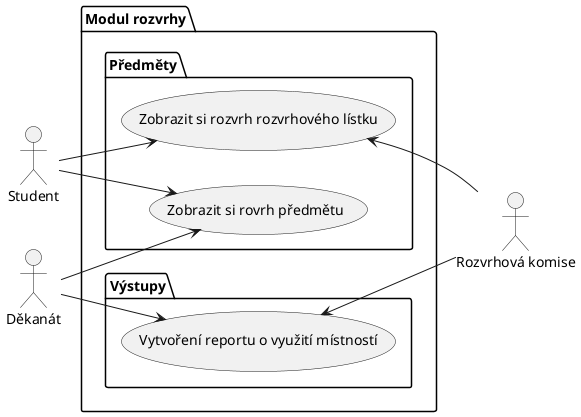

# Studentský informační systém - Modul rozvrhy

Modul rozvrhy slouží k vytváření a prohlížení rozvrhů. 
V rámci modulu jsou vedeny předměty a jejich příslušnost do studijních programů a jednotlivých semestrů studia, 
ve kterých jsou v rámci programu doporučeny. 
Dále jsou v rámci modulu vedeny učebny pro výuku a jejich kapacita. 
Pro každý předmět jsou evidovány rozvrhové lístky přednášek a cvičení, včetně jejich kapacit a vyučujících. 
Modul umožňuje rozvrhové komisi v jednotlivých semestrech vytváření centrálních rozvrhů přiřazováním rozvrhových lístků k učebnám na konkrétní den v týdnu a hodinu. 
Předměty ve stejném studijním programu a semestru musí být rozvrhovány tak, aby měli studenti v daném studijním programu a semestru možnost tyto předměty navštěvovat. 
Dále nesmí docházet k časovým kolizím jednoho učitele. 
Modul umožňuje vytvářet statistické reporty o vytíženosti místností v jednotlivých semestrech. 

## Funkční požadavky

### Slovník

Rozvrhový lístek = základní jednotka rovržení výuky předmětu, určuje čas a místo výuky, výuku předmětu zajišťuje učitel, který je uveden v rozvrhovém lístku. Rozvrhový 
lístek je vytvořen pro každý předmět, který se vyučuje v daném semestru.

### Uživatelské požadavky
Každý opravit svých 5 uživatelský požadavků.

Vybrat si 2 uživatelké požadavky/skupiny požadavků (viz Markovy poznámky na messengeru) a zabrat si je připsáním jména k požadavku.

Rozepsat požadavky do use casů (z toho dva detailně) a případně specifikovat entity s atributy (viz poznámky).

Ondřej
- Děkanát by měl být schopen vytvořit, smazat, upravit předmět.
- Děkanát by měl být schopen specifikovat příslušnost předmětu do studijního programu a prerekvizity, korekvizity... předmětu.
- Rozvrhová komise by měla být schopna vytvořit, smazat a upravit rozvrhový lístek

- Děkanát by měl být schopen zaevidovat, smazat, upravit místo (budova), aby:
   - Se mohla k místu přiřadit učebna a provést kontrala návaznosti rovržení výuky
   - Studenti a učitelé věděli, kam se mají dostavit na výuku.
   - Rozvrhová komise mohla dát předměty pro stejný studijní program a semestr na jedno místo.
- Děkanát by měl být schopen zaevidovat, smazat, upravit učebnu, přiradit ji k místu a specifikovat její kapacitu. 

Marek
- Děkanát by měl být schopen specifikovat průběh doporučeného průběhu studia, aby:
  - Studenti věděli, ve kterých semestrech si mají zapsat jaké předměty, aby měli splněné prerekvizity a byli schopni lépe splnit všechny požadavky.
  - Rozvrhová komise věděla, které kombinace předmětů bude mít většina studentů zapsané ve stejném semestru a mohla je dát na různá místa v rozvrhu.

- Děkanát by měl být schopen specifikovat harmonogram, aby:
  - Všichni věděli, kdy začíná a končí výuka, zkoušková období, kdy jsou prázdniny.
  - Systém věděl, kdy má zobrazovat jaký rozvrh.

- Systém provede kontrolu, že učitel může navštěvovat všechny termíny jeho výuky.
- Systém provede kontrolu, že studenti mohou navštěvovat všechny termíny na povinné předměty.
- Systém provede kontrolu, že v učebně nejsou dva termíny ve stejnou dobu.

Šimon
- Jako rozvrhová komise potřebujeme automatickou kontrolu, že doporučený průběh studia odpovídá prerekvizitám, abychom věděli, jestli jsme doporučený rozvrh navrhli tak, aby studenti byli schopni ho použít.

- Jako student nebo učitel potřebuju exportovat svůj rozvrh, abych si ho mohl dát do kalendáře.
- Jako student nebo učitel potřebuju zobrazit svůj rozvrh, abych věděl, kdy a kde mám být.
- Jako uživateli by se mi mohlo hodit zobrazit rozvrh učebny, abych věděl, kdy můžu do učebny přijít nebo jaké přednášky se tam můžu účastnit.
- Jako uživatel si potřebuju zobrazit rozvrh jiného učitele, abych věděl, kdy se s ním můžu sejít.

Michael
- Jako student si musím být schopen zobrazit rozvrh předmětu, abych si mohl vybrat pro mě vhodnou paralelku přednášky či konkrétní vhodné cvičení.
- Jako student si musím být schopen zobrazit rozvrh rozvrhového lístku, abych se mohl rozhodnout zda mi vyhovuje.
- Jako student bych měl mít možnost nechat si zasílat upozornění na změnu ve výuce, abych věděl, že kdy a kam mám přijít.
- Jako děkanát si musím být schopný zobrazit rozvrh předmětu, abych mohl kontrolovat, zda probíhá výuka.
- Jako rozvrhová komise si musíme být schopni zobrazit rozvrh rozvrhového lístku, abychom mohli zkontrolovat, že daný rozvrhový lístek dává smysl (jednotlivé části se nepřekryjí atd.).
- Jako učitel potřebuji mít možnost zrušit svou výuku v daném termínu, abych dal vědět účastníkům výuky, že se nemusí dostavit.
- Jako děkanát bychom měli mít možnost si nechat automaticky vygenerovat statický report o vytížení místností v jednotlivých semestrech, abychom mohli dělat orgranizační rozhodnutí na základě těchto dat (úprava vytápění místností, zajištění nových prostor atd.).
- Jako rozvrhová komise bychom měli mít možnost si nechat automaticky vygenerovat statický report o vytížení místností v jednotlivých semestrech, abychom mohli lépe rozvrhovat výuku na základě těchto dat. Michael

### Systémové požadavky

[*Document here your system requirements as use case diagrams.*]

Ondřej

⋮

Marek

⋮

Šimon

⋮

Michael

#### Use case scenario
**Precondition**

Uživatel je přihlášen jako člen děkanátu

**Normal**

1. Otevře si `Modul rozvrhy`.
2. Vybere podsekci `Výstupy`.
3. Zvolí možnost `Vytvoření reportu o využití místností`.
4. Vybere si, za které semestry chce vygenerovat daný report.
5. Systém zkontroluje, že je zvolený nějaký semestr.
6. Systém vygeneruje report.
7. Uživatel si stáhne daný report.

**Alternativní scénáře**
- Uživatel nezvolil žádné období (semestr). V tom případě je vyzván ke zvolení nějakého období.
- Nastane chyba při zpracování dat. V tom případě se chyba zaloguje a uživatel je o ní informován.

**Stav systému po dokončení operace**
- Uživatel si úspěšně uložil vygenerovaný report.
- Při zpracování nastala chyba a tato chyba byla zologována pro další šetření.

#### Actors

[*Document here all actors from the use case diagrams. Make a subsection for each actor and their short description in each subsection.*]

##### [*Actor name*]

Děkanát = Je výkonný orgán řízení fakulty po stránce hospodářské a administrativní.

Rozvrhová komise = Poradní orgán pro děkanát, který se zabývá vytvářením předmětů.

Uživatel = Osoba, která má přístup do univerzitního systému.

Student = Osoba, která je zapsána ke studiu.

Učitel = Osoba, která vyučuje předmět.

#### Use cases

[*Document here all use cases. Create a subsection for each use case diagram. If you have only one use case diagram, you do not need a special subsection*]

##### [*Use case diagram title*]

[*Use case diagram in PlantUML*]

To be able to embed PlantUML diagrams to Markdown code with previews in VSCode you need
* Markdown All in One extension
* PlantUML extension
* Mardown Plantuml Preview extension

Follow https://plantuml.com/

[*Describe the diagram in a short paragraph. Describe each use case from the diagram in the detail from the lecture in a separate subsection.*]

###### [*Use case title*]

[*Use case description in the structure from the lecture.*]

[*Add an activity diagram for one use case per a team member*]

## Information model

[*Express the information model of the domain as a UML class diagram in PlantUML. Do not use class methods in the diagram, only classes, class attributes and associations connecting classes.*]

[*Document each class with a short description in a separate subsection*]
navíc description entit co skutečně znamenají
### [*Class name*]

[*Class description*]

